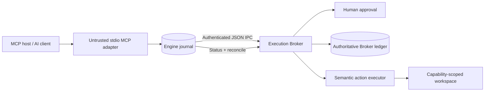

<div align="center">

# Autonomous Intelligence

**A transaction-safe local action layer for AI agents.**

[](https://github.com/coldrazer/autonomous-intelligence/actions/workflows/ci.yml)
[](https://www.python.org/)
[](https://modelcontextprotocol.io/)
[](LICENSE)
[](https://www.microsoft.com/windows)
[](https://github.com/coldrazer/autonomous-intelligence/packages)

Autonomous Intelligence exposes capability-scoped computer actions through MCP while keeping execution, approval, and crash recovery behind a separate local Broker.

[Getting started](#getting-started) · [Client compatibility](#client-compatibility) · [MCP tools](#mcp-interface) · [Safety model](#safety-model) · [Architecture](#architecture) · [Contributing](CONTRIBUTING.md)

</div>

---

## Why this exists

Most desktop-agent prototypes connect probabilistic planning directly to powerful operating-system primitives. That is convenient, but it makes retries, crashes, prompt injection, and ambiguous UI state dangerous.

Autonomous Intelligence draws a hard boundary:

- The **MCP adapter and planner are untrusted**.
- The **Broker derives policy and action class independently**.
- Every side effect is represented by a durable operation and attempt.
- Writes require exact, single-use approval.
- Recovery verifies postconditions before retrying.
- An effect that cannot be reconciled becomes `UNCERTAIN` and stops.

The current release provides a deliberately narrow, production-minded vertical slice for workspace file operations. Windows UI Automation and browser control will be added only when they satisfy the same contracts.

## Key guarantees

| Guarantee | Implementation |
|---|---|
| Capability containment | Canonical workspace paths, resolved parents, protected state paths, and Windows ADS rejection |
| Broker separation | Authenticated local named-pipe IPC with raw JSON messages—no untrusted pickle decoding |
| Durable recovery | Independent Engine and Broker SQLite journals using WAL and `synchronous=FULL` |
| Replay resistance | Stable logical IDs, unique attempt IDs, canonical payload hashes, and mutation rejection |
| Exact approval | Single-use, expiring HMAC approvals bound to one attempt and payload |
| Safe writes | Temporary-file write, flush, atomic replacement, prior-hash precondition, and SHA-256 verification |
| Honest uncertainty | No automatic retry when delivery or postcondition cannot be proven |

## MCP interface

Autonomous Intelligence is an MCP v2 stdio server with five focused tools:

| Tool | Behavior | MCP annotation |
|---|---|---|
| `autonomous_read_file` | Reads bounded UTF-8 content and returns its SHA-256 digest | Read-only, idempotent |
| `autonomous_write_file` | Creates or compare-and-swap replaces a file after Broker approval | Destructive, idempotent |
| `autonomous_recover_incomplete` | Reconciles durable incomplete attempts without blind retries | Idempotent |
| `autonomous_get_attempt_status` | Reads Engine and Broker state for one attempt UUID | Read-only |
| `autonomous_list_recent_operations` | Lists non-sensitive operation summaries | Read-only |

The `autonomous-intelligence://capabilities` resource describes the active workspace and safety boundary.

Tool failures are returned through MCP as `is_error=true`, allowing a host model to correct invalid paths or arguments without mistaking an error string for success.

## Client compatibility

The server is model-agnostic and host-neutral. It speaks MCP over stdio and does not call a vendor-specific LLM API.

| Client | Configuration included | Status |
|---|---|---|
| OpenAI Codex CLI, IDE, and ChatGPT desktop | `.codex/config.toml` | Supported |
| Claude Code | `.mcp.json` | Supported |
| Kimi Code CLI | `.kimi-code/mcp.json` | Supported |
| Google Antigravity IDE and CLI | `.agents/mcp_config.json` | Supported |
| Gemini CLI | `.gemini/settings.json` | Supported |
| Cursor | `.cursor/mcp.json` | Supported |
| VS Code / GitHub Copilot | `.vscode/mcp.json` | Supported |
| Other local MCP clients | `mcp-config.example.json` | Standard stdio fallback |

Use the complete [multi-client setup guide](docs/CLIENT_SETUP.md) for global and project-scoped installation, verification commands, and client-specific approval behavior.

## Architecture



The Broker is not embedded in the MCP process. If the Broker is unavailable, tools fail visibly instead of falling back to direct host access.

## Getting started

### Requirements

- Windows 10/11
- Python 3.11 or newer
- An MCP host such as Codex, ChatGPT desktop, or another compatible client

### Install from source

```powershell
git clone https://github.com/coldrazer/autonomous-intelligence.git
cd autonomous-intelligence

python -m venv .venv
.\.venv\Scripts\Activate.ps1
python -m pip install -e ".[dev]"
```

### 1. Start the Broker

Run the Broker in a visible terminal so write approvals can be reviewed:

```powershell
autonomous-intelligence --workspace C:\path\to\allowed-workspace broker
```

The Broker denies writes by default unless the exact operation is approved. `--approval-mode allow` exists only for disposable automated tests.

### 2. Connect an LLM client

Generate configuration for any supported host without modifying its files:

```powershell
autonomous-intelligence --workspace C:\path\to\allowed-workspace `
  client-config claude
```

Valid client names are `codex`, `claude`, `kimi`, `antigravity`, `gemini`, `cursor`, `vscode`, and `generic`.

For Codex, the direct registration command is:

With the virtual environment active:

```powershell
codex mcp add autonomous-intelligence -- `
  autonomous-intelligence-mcp `
  --workspace C:\path\to\allowed-workspace
```

Verify the registration:

```powershell
codex mcp get autonomous-intelligence
codex mcp list
```

Restart the local Codex client after changing MCP configuration. The ChatGPT desktop app, Codex CLI, and IDE extension share the same Codex MCP configuration.

For manual configuration, add this to `~/.codex/config.toml`:

```toml
[mcp_servers.autonomous-intelligence]
command = "C:\\path\\to\\autonomous-intelligence\\.venv\\Scripts\\autonomous-intelligence-mcp.exe"
args = ["--workspace", "C:\\path\\to\\allowed-workspace"]
startup_timeout_sec = 20
tool_timeout_sec = 120
default_tools_approval_mode = "auto"

[mcp_servers.autonomous-intelligence.tools.autonomous_write_file]
approval_mode = "prompt"
```

A generic host configuration is also available in [`mcp-config.example.json`](mcp-config.example.json). See [`docs/CLIENT_SETUP.md`](docs/CLIENT_SETUP.md) for Claude Code, Kimi, Antigravity, Gemini CLI, Cursor, VS Code, and generic stdio clients.

### GitHub Container package

Container-oriented MCP hosts can pull the signed multi-platform OCI image:

```powershell
docker pull ghcr.io/coldrazer/autonomous-intelligence:0.3.1
```

The native wheel is recommended for Windows desktop use. Container deployments run the Broker and MCP adapter separately with a shared state volume; see the [container guide](docs/CONTAINER.md) for the exact commands and security boundary.

## Direct CLI

The diagnostic CLI uses the same Engine, Broker, policy, and journals:

```powershell
# Read a workspace file
autonomous-intelligence --workspace C:\workspace read notes.txt

# Create a file; approval occurs in the Broker terminal
autonomous-intelligence --workspace C:\workspace write output.txt `
  --content "verified output"

# Recover attempts after a process restart
autonomous-intelligence --workspace C:\workspace recover

# Stop the Broker
autonomous-intelligence --workspace C:\workspace shutdown
```

## Safety model

### Dispatch lifecycle

```text
Engine PREPARED
  → Broker ACCEPTED
  → approval issued and consumed when required
  → Broker IN_FLIGHT
  → semantic effect attempted
  → Broker DELIVERY_ATTEMPTED
  → typed postcondition evaluated
  → Engine VERIFIED
```

`IN_FLIGHT` is intentionally conservative: a crash immediately before delivery and one immediately after delivery are indistinguishable until reconciliation.

### Recovery behavior

| Broker observation | Recovery decision |
|---|---|
| No Broker record | Safely resubmit the prepared attempt |
| `ACCEPTED` | Resume; execution has not begun |
| `IN_FLIGHT` and postcondition true | Verify without redispatch |
| `IN_FLIGHT` and original precondition unchanged | Supersede and retry with a new attempt ID |
| `IN_FLIGHT` and neither condition provable | Mark `UNCERTAIN` and stop |
| `DELIVERY_ATTEMPTED` | Evaluate the typed postcondition |

Autonomous Intelligence does not claim exactly-once execution for arbitrary GUI actions or external systems that provide neither idempotency keys nor reliable reconciliation.

## Development

Install development dependencies and run the complete suite:

```powershell
python -m pip install -e ".[dev]"
python -m pytest
```

The tests cover:

- Journal state transitions and replay conflicts
- Approval denial, expiry, binding, and single use
- Workspace escapes and protected state paths
- Crash recovery before and after side effects
- MCP schemas, annotations, resources, and tool-error semantics
- Host-specific configuration rendering for eight MCP client formats
- The complete Windows subprocess chain: MCP client → stdio server → named pipe → Broker → workspace

See [`docs/PROTOCOL.md`](docs/PROTOCOL.md) for the wire and recovery contract and [`docs/IMPLEMENTATION_STATUS.md`](docs/IMPLEMENTATION_STATUS.md) for current scope and roadmap.

## Roadmap

- [x] Transactional Engine and authoritative Broker ledger
- [x] Capability-scoped semantic file actions
- [x] MCP v2 stdio adapter
- [x] Codex, Claude, Kimi, Antigravity, Gemini, Cursor, and VS Code setup assets
- [x] Multi-platform GitHub Container package with SBOM and provenance
- [x] Windows named-pipe integration tests
- [ ] Read-only Windows UI Automation observation adapter
- [ ] Structural UI fingerprints and ambiguity rejection
- [ ] Human-input contention detection
- [ ] Browser CDP adapter with origin and frame binding
- [ ] Hardened Windows service identity, ACLs, and signed installer

## Security

Please read [`SECURITY.md`](SECURITY.md) before deploying or reporting a vulnerability. The current release is an evaluated local vertical slice—not a claim that unrestricted autonomous desktop control is safe.

## Contributing

Contributions are welcome when they preserve the transaction and policy boundary. Start with [`CONTRIBUTING.md`](CONTRIBUTING.md).

## License

Released under the [MIT License](LICENSE).
